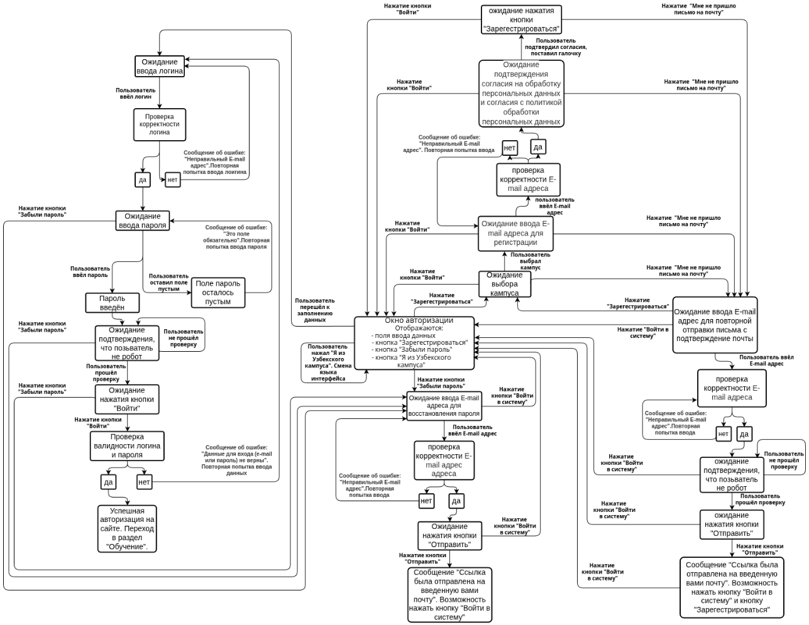

# Диаграмма переходов и состояний для страницы авторизации https://applicant.21-school.ru/auth

# Таблица переходов и состояний для страницы авторизации https://applicant.21-school.ru/auth

<table>
    <thead>
        <tr>
    </thead>
    <tbody>
        <tr>
            <td rowspan=4 align="center">Состояние
            <td rowspan=4 align="center">Триггер
            <td rowspan=4 align="center">Условие
            <td rowspan=4 align="center">Следующее состояние  
        </tr>
        <thead>
        <tr>
    </thead>
            <td rowspan=4 align="center">Ожидание ввода логина
            <td rowspan=4 align="center">Пользователь вводит логин
            <td rowspan=4 align="center">Логин корректный
            <td rowspan=4 align="center">Ожидание ввода пароля
            </tr>
        <thead>
        <tr>
    </thead>
            <td rowspan=4 align="center">Ожидание ввода логина
            <td rowspan=4 align="center">Пользователь вводит логин
            <td rowspan=4 align="center">Логин не корректный
            <td rowspan=4 align="center">Сообщение об ошибки "Неправильный E-mail адрес". Ожидание ввода логина
            </tr>
        <thead>
        <tr>
    </thead>
            <td rowspan=4 align="center">Ожидание ввода логина
            <td rowspan=4 align="center">Пользователь нажимает на кнопку "Забыли пароль"
            <td rowspan=4 align="center">Пользователь не помнит пароль
            <td rowspan=4 align="center">Ожидание ввода E-mail адреса для восстановления пароля
            </tr>
        <thead>
        <tr>
    </thead>
    <td rowspan=4 align="center">Ожидание ввода логина
            <td rowspan=4 align="center">Пользователь нажимает на кнопку "Регистрация"
            <td rowspan=4 align="center">У пользователя нет учётной записи
            <td rowspan=4 align="center">Ожидание выбора кампуса
            </tr>
        <thead>
        <tr>
    </thead>
            <td rowspan=4 align="center">Ожидание ввода логина
            <td rowspan=4 align="center">Пользователь нажимает на кнопку "Я из Узбекского кампуса"
            <td rowspan=4 align="center">Пользователь нажал на кнопку "Я из Узбекского кампуса"
            <td rowspan=4 align="center">Смена языка интерфейса на Узбекский. Ожидание ввода логина
            </tr>
        <thead>
        <tr>
    </thead>
            <td rowspan=4 align="center">Ожидание ввода пароля
            <td rowspan=4 align="center">Пользователь вводит пароль
            <td rowspan=4 align="center">Пароль корректный
            <td rowspan=4 align="center">Ожидание подтверждения, что пользователь не робот
            </tr>
        <thead>
        <tr>
    </thead>
    <td rowspan=4 align="center">Ожидание ввода пароля
            <td rowspan=4 align="center">Пользователь вводит пароль
            <td rowspan=4 align="center">Пароль не введён
            <td rowspan=4 align="center">Сообщение об ошибке "Это поле обязательно". Ожидание ввода пароля
            </tr>
        <thead>
        <tr>
    </thead>
            <td rowspan=4 align="center">Ожидание ввода пароля
            <td rowspan=4 align="center">Пользователь нажимает на кнопку "Забыли пароль"
            <td rowspan=4 align="center">Пользователь не помнит пароль
            <td rowspan=4 align="center">Ожидание ввода E-mail адреса для восстановления пароля
            </tr>
        <thead>
        <tr>
    </thead>
    <td rowspan=4 align="center">Ожидание ввода пароля
            <td rowspan=4 align="center">Пользователь нажимает на кнопку "Регистрация"
            <td rowspan=4 align="center">У пользователя нет учётной записи
            <td rowspan=4 align="center">Ожидание выбора кампуса
            </tr>
        <thead>
        <tr>
    </thead>
            <td rowspan=4 align="center">Ожидание ввода пароля
            <td rowspan=4 align="center">Пользователь нажимает на кнопку "Я из Узбекского кампуса"
            <td rowspan=4 align="center">Пользователь нажал на кнопку "Я из Узбекского кампуса"
            <td rowspan=4 align="center">Смена языка интерфейса на Узбекский. Ожидание ввода логина
            </tr>
        <thead>
        <tr>
    </thead>
            <td rowspan=4 align="center">Ожидание подтверждения, что пользователь не робот
            <td rowspan=4 align="center">Пользователь проходит форму подтверждения, что он не робот
            <td rowspan=4 align="center">Проверка пройдена
            <td rowspan=4 align="center">Ожидание нажатия кнопки "Войти" 
            </tr>
        <thead>
        <tr>
    </thead>
    <td rowspan=4 align="center">Ожидание подтверждения, что пользователь не робот
            <td rowspan=4 align="center">Пользователь проходит форму подтверждения, что он не робот
            <td rowspan=4 align="center">Проверка не пройдена
            <td rowspan=4 align="center">Ожидание подтверждения, что пользователь не робот
            </tr>
        <thead>
        <tr>
    </thead>
            <td rowspan=4 align="center">Ожидание подтверждения, что пользователь не робот
            <td rowspan=4 align="center">Пользователь нажимает на кнопку "Забыли пароль"
            <td rowspan=4 align="center">Пользователь не помнит пароль
            <td rowspan=4 align="center">Ожидание ввода E-mail адреса для восстановления пароля
            </tr>
        <thead>
        <tr>
    </thead>
    <td rowspan=4 align="center">Ожидание подтверждения, что пользователь не робот
            <td rowspan=4 align="center">Пользователь нажимает на кнопку "Регистрация"
            <td rowspan=4 align="center">У пользователя не учётной записи
            <td rowspan=4 align="center">Ожидание выбора кампуса
            </tr>
        <thead>
        <tr>
    </thead>
            <td rowspan=4 align="center">Ожидание нажатия кнопки "Войти"
            <td rowspan=4 align="center">Пользователь нажимает кнопку "Войти"
            <td rowspan=4 align="center">Логин и пароль валидные
            <td rowspan=4 align="center"> Авторизация, переход в учётную запись
            </tr>
        <thead>
        <tr>
    </thead>
    <td rowspan=4 align="center">Ожидание нажатия кнопки "Войти"
            <td rowspan=4 align="center">Пользователь нажимает кнопку "Войти"
            <td rowspan=4 align="center">Логин и пароль не валидные
            <td rowspan=4 align="center"> Сообщение об ошибке "Данные для входа (e-mail или пароль) не верны". Ожидание ввода логина
             </tr>
        <thead>
        <tr>
    </thead>
            <td rowspan=4 align="center">Ожидание нажатия кнопки "Войти"
            <td rowspan=4 align="center">Пользователь нажимает на кнопку "Забыли пароль"
            <td rowspan=4 align="center">Пользователь не помнит пароль
            <td rowspan=4 align="center">Ожидание ввода E-mail адреса для восстановления пароля
            </tr>
        <thead>
        <tr>
    </thead>
    <td rowspan=4 align="center">Ожидание нажатия кнопки "Войти"
            <td rowspan=4 align="center">Пользователь нажимает на кнопку "Регистрация"
            <td rowspan=4 align="center">У пользователя нет учётной записи
            <td rowspan=4 align="center">Ожидание выбора кампуса
            </tr>
        <thead>
        <tr>
    </thead>
            <td rowspan=4 align="center">Ожидание ввода E-mail адреса для восстановления пароля
            <td rowspan=4 align="center">Пользователь вводит E-mail адрес 
            <td rowspan=4 align="center"> E-mail адрес корректный
            <td rowspan=4 align="center"> Ожидание нажатия кнопки "Отправить"
            </tr>
        <thead>
        <tr>
    </thead>
    <td rowspan=4 align="center">Ожидание ввода E-mail адреса для восстановления пароля
            <td rowspan=4 align="center">Пользователь вводит E-mail адрес 
            <td rowspan=4 align="center"> E-mail адрес не корректный
            <td rowspan=4 align="center"> Сообщение "Неправильный E-mail адрес"
            </tr>
        <thead>
        <tr>
    </thead>
    <td rowspan=4 align="center">Ожидание ввода E-mail адреса для восстановления пароля
            <td rowspan=4 align="center">Пользователь нажимает кнопку "Войти в систему" 
            <td rowspan=4 align="center"> Пользователь нажал кнопку "Войти в систему" 
            <td rowspan=4 align="center"> Ожидание ввода логина
            </tr>
        <thead>
        <tr>
    </thead>
            <td rowspan=4 align="center">Ожидание нажатия кнопки "Отправить"
            <td rowspan=4 align="center">Пользователь нажал кнопку "Отправить"
            <td rowspan=4 align="center">E-mail адрес корректный
            <td rowspan=4 align="center">Сообщение "Ссылка была отправлена на введенную вами почту"
            </tr>
        <thead>
        <tr>
    </thead>
            <td rowspan=4 align="center">Ожидание нажатия кнопки "Отправить"
            <td rowspan=4 align="center">Пользователь нажал кнопку "Войти в систему"
            <td rowspan=4 align="center">Пользователь нажал кнопку "Войти в систему"
            <td rowspan=4 align="center">Ожидание ввода логина
            </tr>
        <thead>
        <tr>
    </thead>
    <td rowspan=4 align="center">Ожидание выбора кампуса
            <td rowspan=4 align="center">Пользователь выбирает из списка доступный кампус
            <td rowspan=4 align="center">Нужный кампус есть в списке доступных
            <td rowspan=4 align="center">Ожидание ввода E-mail адреса для регистрации
            /tr>
        <thead>
        <tr>
    </thead>
    <td rowspan=4 align="center">Ожидание выбора кампуса
            <td rowspan=4 align="center">Пользователь оставляет поле выбора кампуса пустым
            <td rowspan=4 align="center">Пустое поле выбора кампуса
            <td rowspan=4 align="center">Сообщение об ошибке "Это поле обязательно" Ожидание выбора кампуса
            </tr>
        <thead>
        <tr>
    </thead>
            <td rowspan=4 align="center">Ожидание выбора кампуса
            <td rowspan=4 align="center"> Пользователь нажимает кнопку "Вход"
            <td rowspan=4 align="center"> Пользователь нажал кнопку "Вход"
            <td rowspan=4 align="center"> Ожидание ввода логина
            </tr>
        <thead>
        <tr>
    </thead>
            <td rowspan=4 align="center">Ожидание выбора кампуса
            <td rowspan=4 align="center"> Пользователь нажимает кнопку "Забыли пароль"
            <td rowspan=4 align="center"> Пользователь нажал кнопку "Забыли пароль"
            <td rowspan=4 align="center"> Ожидание ввода E-mail адреса для восстановления пароля
            <thead>
        <tr>
    </thead>
            <td rowspan=4 align="center">Ожидание выбора кампуса
            <td rowspan=4 align="center"> Пользователь нажимает кнопку "Я из Узбекского кампуса"
            <td rowspan=4 align="center"> Пользователь нажал кнопку "Я из Узбекского кампуса"
            <td rowspan=4 align="center"> Смена языка интерфей на Узбекский. Ожидание ввода логина
            <thead>
        <tr>
    </thead>
            <td rowspan=4 align="center">Ожидание выбора кампуса
            <td rowspan=4 align="center"> Пользователь нажимает кнопку "Мне не пришло письмо на почту"
            <td rowspan=4 align="center"> Пользователь нажал кнопку "Мне не пришло письмо на почту"
            <td rowspan=4 align="center"> Ожидание ввода E-mail адрес для повторной отправки письма с подтверждение почты
            </tr>
        <thead>
        <tr>
    </thead>
            <td rowspan=4 align="center">Ожидание ввода E-mail адреса для регистрации
            <td rowspan=4 align="center">Пользователь вводит E-mail адрес
            <td rowspan=4 align="center">E-mail адрес корректный
            <td rowspan=4 align="center"> Ожидание подтверждения согласия  на обработку персональных данных и согласия с политикой обработки персональных данных
            </tr>
        <thead>
        <tr>
    </thead>
     <td rowspan=4 align="center">Ожидание ввода E-mail адреса для регистрации
            <td rowspan=4 align="center">Пользователь вводит E-mail адрес
            <td rowspan=4 align="center">E-mail адрес не корректный
            <td rowspan=4 align="center">Сообщение об ошибке "Неправильный E-mail адрес". Ожидание ввода E-mail адреса для регистрации 
             </tr>
        <thead>
        <tr>
    </thead>
     <td rowspan=4 align="center">Ожидание ввода E-mail адреса для регистрации
            <td rowspan=4 align="center">Пользователь поле E-mail адрес пустым
            <td rowspan=4 align="center">Пустое поле E-mail адреса
            <td rowspan=4 align="center">"Это поле обязательно". Ожидание ввода E-mail адреса для регистрации
            </tr>
        <thead>
        <tr>
    </thead>
            <td rowspan=4 align="center">Ожидание ввода E-mail адреса для регистрации
            <td rowspan=4 align="center"> Пользователь нажимает кнопку "Вход"
            <td rowspan=4 align="center"> Пользователь нажал кнопку "Вход"
            <td rowspan=4 align="center"> Ожидание ввода логина
            </tr>
        <thead>
        <tr>
    </thead>
            <td rowspan=4 align="center">Ожидание ввода E-mail адреса для регистрации
            <td rowspan=4 align="center"> Пользователь нажимает кнопку "Забыли пароль"
            <td rowspan=4 align="center"> Пользователь нажал кнопку "Забыли пароль"
            <td rowspan=4 align="center"> Ожидание ввода E-mail адреса для восстановления пароля
            <thead>
        <tr>
    </thead>
            <td rowspan=4 align="center">Ожидание ввода E-mail адреса для регистрации
            <td rowspan=4 align="center"> Пользователь нажимает кнопку "Я из Узбекского кампуса"
            <td rowspan=4 align="center"> Пользователь нажал кнопку "Я из Узбекского кампуса"
            <td rowspan=4 align="center"> Смена языка интерфей на Узбекский. Ожидание ввода логина
            <thead>
        <tr>
    </thead>
            <td rowspan=4 align="center">Ожидание ввода E-mail адреса для регистрации
            <td rowspan=4 align="center"> Пользователь нажимает кнопку "Мне не пришло письмо на почту"
            <td rowspan=4 align="center"> Пользователь нажал кнопку "Мне не пришло письмо на почту"
            <td rowspan=4 align="center"> Ожидание ввода E-mail адрес для повторной отправки письма с подтверждение почты 
            </tr>
        <thead>
        <tr>
    </thead>
            <td rowspan=4 align="center">Ожидание подтверждения согласия  на обработку персональных данных и согласия с политикой обработки персональных данных
            <td rowspan=4 align="center"> Пользователь поставит галочку для согласия
            <td rowspan=4 align="center"> Пользователь поставил галочку для согласия
            <td rowspan=4 align="center"> Ожидания нажатия кнопки "Зарегестрироваться"
            </tr>
        <thead>
        <tr>
    </thead>
            <td rowspan=4 align="center">Ожидание подтверждения согласия  на обработку персональных данных и согласия с политикой обработки персональных данных
            <td rowspan=4 align="center"> Пользователь не поставит галочку для согласия
            <td rowspan=4 align="center"> Пользователь не поставил галочку для согласия
            <td rowspan=4 align="center"> Ожидание Подтверждения согласия  на обработку персональных данных и согласия с политикой обработки персональных данных
            </tr>
        <thead>
        <tr>
    </thead>
            <td rowspan=4 align="center">Ожидание подтверждения согласия  на обработку персональных данных и согласия с политикой обработки персональных данных
            <td rowspan=4 align="center"> Пользователь нажимает кнопку "Вход"
            <td rowspan=4 align="center"> Пользователь нажал кнопку "Вход"
            <td rowspan=4 align="center"> Ожидание ввода логина
            </tr>
        <thead>
        <tr>
    </thead>
            <td rowspan=4 align="center">Ожидание подтверждения согласия  на обработку персональных данных и согласия с политикой обработки персональных данных
            <td rowspan=4 align="center"> Пользователь нажимает кнопку "Забыли пароль"
            <td rowspan=4 align="center"> Пользователь нажал кнопку "Забыли пароль"
            <td rowspan=4 align="center"> Ожидание ввода E-mail адреса для восстановления пароля
            <thead>
        <tr>
    </thead>
            <td rowspan=4 align="center">Ожидание подтверждения согласия  на обработку персональных данных и согласия с политикой обработки персональных данных
            <td rowspan=4 align="center"> Пользователь нажимает кнопку "Я из Узбекского кампуса"
            <td rowspan=4 align="center"> Пользователь нажал кнопку "Я из Узбекского кампуса"
            <td rowspan=4 align="center"> Смена языка интерфей на Узбекский. Ожидание ввода логина
            <thead>
        <tr>
    </thead>
            <td rowspan=4 align="center">Ожидание подтверждения согласия  на обработку персональных данных и согласия с политикой обработки персональных данных
            <td rowspan=4 align="center"> Пользователь нажимает кнопку "Мне не пришло письмо на почту"
            <td rowspan=4 align="center"> Пользователь нажал кнопку "Мне не пришло письмо на почту"
            <td rowspan=4 align="center"> Ожидание ввода E-mail адрес для повторной отправки письма с подтверждение почты 
            </tr>
        <thead>
        <tr>
    </thead>
            <td rowspan=4 align="center">Ожидание нажатия кнопки "Зарегестрироваться"
            <td rowspan=4 align="center"> Пользователь нажимает кнопку "Зарегестрироваться"
            <td rowspan=4 align="center"> Все поля заполнены
            <td rowspan=4 align="center"> Отправка сообщения на указаный имейл адрес. Ожидание ввода логина
            </tr>
        <thead>
        <tr>
    </thead>
            <td rowspan=4 align="center">Ожидание нажатия кнопки "Зарегестрироваться"
            <td rowspan=4 align="center"> Пользователь нажимает кнопку "Вход"
            <td rowspan=4 align="center"> Пользователь нажал кнопку "Вход"
            <td rowspan=4 align="center"> Ожидание ввода логина
            </tr>
        <thead>
        <tr>
    </thead>
            <td rowspan=4 align="center">Ожидание нажатия кнопки "Зарегестрироваться"
            <td rowspan=4 align="center"> Пользователь нажимает кнопку "Забыли пароль"
            <td rowspan=4 align="center"> Пользователь нажал кнопку "Забыли пароль"
            <td rowspan=4 align="center"> Ожидание ввода E-mail адреса для восстановления пароля
            <thead>
        <tr>
    </thead>
            <td rowspan=4 align="center">Ожидание нажатия кнопки "Зарегестрироваться"
            <td rowspan=4 align="center"> Пользователь нажимает кнопку "Я из Узбекского кампуса"
            <td rowspan=4 align="center"> Пользователь нажал кнопку "Я из Узбекского кампуса"
            <td rowspan=4 align="center"> Смена языка интерфей на Узбекский. Ожидание ввода логина
            <thead>
        <tr>
    </thead>
            <td rowspan=4 align="center">Ожидание нажатия кнопки "Зарегестрироваться"
            <td rowspan=4 align="center"> Пользователь нажимает кнопку "Мне не пришло письмо на почту"
            <td rowspan=4 align="center"> Пользователь нажал кнопку "Мне не пришло письмо на почту"
            <td rowspan=4 align="center"> Ожидание ввода E-mail адрес для повторной отправки письма с подтверждение почты
            </tr>
        <thead>
        <tr>
    </thead>
            <td rowspan=4 align="center">Ожидание ввода E-mail адрес для повторной отправки письма с подтверждение почты
            <td rowspan=4 align="center">Пользователь ввёл E-mail адрес
            <td rowspan=4 align="center">E-mail адрес корректный
            <td rowspan=4 align="center"> Ожидание нажатия кнопки "Отправить"
            </tr>
        <thead>
        <tr>
    </thead>
            <td rowspan=4 align="center">Ожидание ввода E-mail адрес для повторной отправки письма с подтверждение почты
            <td rowspan=4 align="center">Пользователь ввёл E-mail адрес
            <td rowspan=4 align="center">E-mail адрес не корректный
            <td rowspan=4 align="center"> Сообщение об ошибке "Неправильный E-mail адрес". Ожидание ввода E-mail адрес для повторной отправки письма с подтверждение почты
            </tr>
        <thead>
        <tr>
    </thead>
            <td rowspan=4 align="center">Ожидание ввода E-mail адрес для повторной отправки письма с подтверждение почты
            <td rowspan=4 align="center">Пользователь нажимает на кнопку "Войти в систему"
            <td rowspan=4 align="center">Пользователь нажал на кнопку "Войти в систему"
            <td rowspan=4 align="center"> Ожидание ввода логина
            </tr>
        <thead>
        <tr>
    </thead>
            <td rowspan=4 align="center">Ожидание ввода E-mail адрес для повторной отправки письма с подтверждение почты
            <td rowspan=4 align="center">Пользователь нажимает на кнопку "Зарегестрироваться"
            <td rowspan=4 align="center">Пользователь нажал на кнопку "Зарегестрироваться"
            <td rowspan=4 align="center"> Ожидание ввода E-mail адреса для регистрации  
        </tr>
        <thead>
        <tr>
    <tbody>
        <tr>     
        </tr>
    </tbody>
</table>

