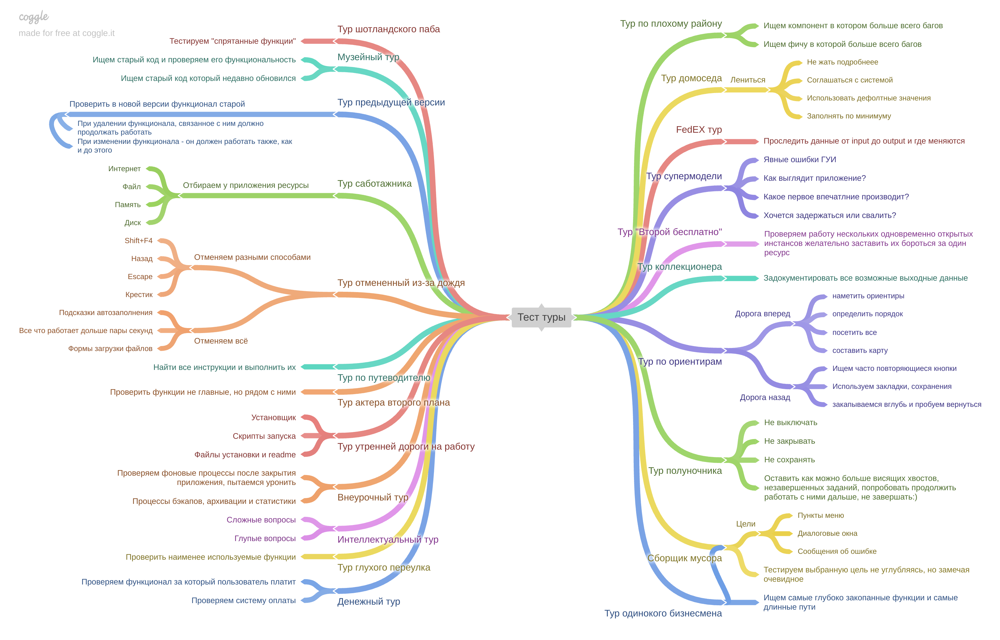

# Тестовые туры.

<table>
    <thead>
        <tr>
    </thead>
    <tbody>
        <tr>
            <td rowspan=4 align="center"> Название
            <td rowspan=4 align="center"> Цель
            </tr>
        <thead>
        <tr>
    </thead>
    <tbody>
        <tr>
            <td rowspan=4 align="center">Тур Шотнандского бара
            <td rowspan=4 align="center">Найти и протестировать функции, которые сложно найти, если заранее о них не знаешь. Эти функции передают “из уст в уста” наученные опытом коллеги, их можно нагуглить. Но с наскока простой пользователь их не найдет. Как житель мегаполиса пройдет мимо крутого паба, не зная, что внутри классное пиво и вежливые официанты.
            <thead>
        <tr>
    </thead>
    <tbody>
        <tr>
            <td rowspan=4 align="center"> Музейный тур
            <td rowspan=4 align="center"> Найти старый код в системе контроля версий, который:
            <thead>
        <tr>
    </thead>
    <tbody>
        <tr>
            <td rowspan=4 align="center"> Тур предыдущей версии
            <td rowspan=4 align="center"> Регрессионное тестирование — проверяем, что функциональность, которая работала до новой версии, продолжает работать.
            <tr>
    </thead>
    <tbody>
        <tr>
            <td rowspan=4 align="center"> Тур саботажника
            <td rowspan=4 align="center"> Саботировать работу приложения — запустить действие и отобрать ресурсы, необходимые для его выполнения.
            <tr>
    </thead>
    <tbody>
        <tr>
            <td rowspan=4 align="center"> Тур отменённый из-за дождя
            <td rowspan=4 align="center"> Найти функции, которые работают дольше пары секунд, запустить и отменить!
Начать операцию и отменить.
Начать операцию, потом начать ее снова без остановки первой.
Начать операцию, отменить и повторить.
            <tr>
    </thead>
    <tbody>
        <tr>
            <td rowspan=4 align="center"> Тур по путеводителю
            <td rowspan=4 align="center"> Найти все инструкции в приложении и выполнить их. 
            <tr>
    </thead>
    <tbody>
        <tr>
            <td rowspan=4 align="center"> Тур актёра второго плана
            <td rowspan=4 align="center"> Проверить функции, которые не главные, но находятся рядом с ними.
            <tr>
    </thead>
    <tbody>
        <tr>
            <td rowspan=4 align="center"> Тур утренней дороги на работу
            <td rowspan=4 align="center"> Проверить установку приложения. Проверить скрипт запуска.
            <tr>
    </thead>
    <tbody>
        <tr>
            <td rowspan=4 align="center"> Внеурочный тур
            <td rowspan=4 align="center"> Проверить все задачи, выполняющиеся в фоновом режиме.
            <tr>
    </thead>
    <tbody>
        <tr>
            <td rowspan=4 align="center"> Интелектуальный тур
            <td rowspan=4 align="center"> Задавать приложению «сложные» вопросы, нагружать его по максимуму. Или наоборот, задавать глупые вопросы для привлечения внимания.
            <tr>
    </thead>
    <tbody>
        <tr>
            <td rowspan=4 align="center"> Тур глухого переулка
            <td rowspan=4 align="center"> Проверить наименее используемые функции. Везде, где видишь список — бери самый низ по приоритету.
            <tr>
    </thead>
    <tbody>
        <tr>
            <td rowspan=4 align="center"> Денежный тур
            <td rowspan=4 align="center"> Найти функции, которые заставляют людей тратить деньги на ваше ПО и проверить их работу.
            <tr>
    </thead>
    <tbody>
        <tr>
            <td rowspan=4 align="center"> Тур по плохому району
            <td rowspan=4 align="center"> Найти компонент в баг-трекере, в котором больше всего задач и исследовать его.
Найти новое свойство или улучшение, с которым связано больше всего багов (если в баг-трекере расставляются связи между задачами) и исследовать его.
            <tr>
    </thead>
    <tbody>
        <tr>
            <td rowspan=4 align="center"> Тур домоседа
            <td rowspan=4 align="center"> Делать так мало работы, как только возможно:
— соглашаться со всеми дефолтными значениями;
— оставлять поля пустыми;
— заполнять в форме минимум значений;
— никогда не кликать на “подробнее”;
— переключать вкладки без ввода данных;
— и так далее.
            <tr>
    </thead>
    <tbody>
        <tr>
            <td rowspan=4 align="center"> FedEx тур
            <td rowspan=4 align="center"> проследить за путем входных данных (inputs). Найти и проверить все функции, которые их используют: сохраняют, меняют, выводят (outputs).
            <tr>
    </thead>
    <tbody>
        <tr>
            <td rowspan=4 align="center"> Тур супермодели
            <td rowspan=4 align="center"> Проверить, как приложение выглядит и какое первое впечатление производит.
            <tr>
    </thead>
    <tbody>
        <tr>
            <td rowspan=4 align="center"> Тур "Второй бесплатно"
            <td rowspan=4 align="center"> Проверить, как приложение работает в мультипоточном режиме. Запустите приложение, потом запустите вторую копию, потом третью. Теперь запустите на них функции, которые отжирают память, пишут на диск или блокируют файл. 
            <tr>
    </thead>
    <tbody>
        <tr>
            <td rowspan=4 align="center"> Тур коллекционера
            <td rowspan=4 align="center"> Пройтись везде, где только можно, в приложении, и задокументировать все выходные данные. 
            <tr>
    </thead>
    <tbody>
        <tr>
            <td rowspan=4 align="center"> Тур по риентирам
            <td rowspan=4 align="center"> Метод Уиттакера, «дорога вперед» — наметить список ориентиров и исследовать приложение, переходя от одного к другому.

Метод Балто, «дорога назад» — сохранять свои действия, чтобы можно было вернуться к ним в любой момент. Делать закладки, сохранять настройки. Уходить далеко вглубь приложения, а потом возвращаться по закладкам.
            <tr>
    </thead>
    <tbody>
        <tr>
            <td rowspan=4 align="center"> Тур полуночника
            <td rowspan=4 align="center"> Проверить, как долго приложение будет работать, оставаясь запущенным. Откройте приложение и не закрывайте его. Работайте с ним, нагружайте его, но не закрывайте. 
            <tr>
    </thead>
    <tbody>
        <tr>
            <td rowspan=4 align="center"> Тур сборщика мусора
            <td rowspan=4 align="center"> Выбрать цели (например, все пункты меню, все сообщения об ошибках, все диалоговые окна) и посещать каждый пункт наикратчайшим путем. Не останавливаясь тестировать детально, но замечая очевидные вещи.
            <tr>
    </thead>
    <tbody>
        <tr>
            <td rowspan=4 align="center"> Тур одинокого бизнесмена
            <td rowspan=4 align="center"> Посетить (и, конечно, протестировать) функции, которые расположены дальше всего от точки входа в приложение. 
Путешествовать сквозь приложение как можно дольше, прежде чем достигнуть места назначения. Предпочитайте длинные пути коротким. Выберите страницу, похороненную глубже всего в приложении.
            <tr>
    </thead>
    <tbody>
        <tr>
            <td rowspan=4 align="center"> Тур несоциального человека
            <td rowspan=4 align="center"> 
- opposite tour — вводить наименее хорошие входные данные везде, где только возможно — данные, которые выходят из контекста, явно глупые или полностью бессмысленные.

- illegal inputs — вводить значения, которые не должны быть введены. Входные данные неверного типа, неверного формата, слишком длинные, слишком короткие итд. Аналогично туру по плохим районам.

- wrong turn tour — выполнять действия в неправильном порядке. Возьмите группу правильных действий и перемешайте их так, чтобы последовательность оказалась неверной.
<tr>
    </thead>
    <tbody>
        <tr>
            <td rowspan=4 align="center"> Тур невротика
            <td rowspan=4 align="center"> Повторять одно действие снова и снова. Вводить одинаковые значения, пока не надоест
            </tr>
        </tr>
    </tbody>
</table>

# Задание 2 из проекта QA2_Test artifacts. Чек-лист для раздела «Как мы учим» на сайте «Школы 21»

1. **Проверка доступности страницы** (Убедиться, что страница загружается без ошибок и доступна для пользователей).
2. **Проверка структуры контента** (Убедиться, что контент разделен на логические блоки и легко воспринимается).
3. **Проверка наличия информации о методах обучения** (Убедиться, что описаны основные методы и подходы, используемые в обучении).
4. **Проверка наличия информации о проектах** (Убедиться, что указаны информация о проектах в процессе обучения).
5. **Проверка наличия информации о расписании занятий** (Убедиться, что указано расписание занятий).
6. **Проверка наличия информации о росте навыков** (Убедиться, что указана информация о прокачке навыков в ходе обучения).
7. **Проверка наличия контактной информации** (Убедиться, что есть возможность связаться с представителями школы для получения дополнительной информации).
8. **Проверка кликабельности кнопок** (Убедиться, что все кнопки на сайте работают, при нажатии происходит переход в соответствующий раздел).
9. **Проверка изменений интерфейса** (Убедиться, что при изменении размера окна браузера информация остаётся доступной в своих блоках, не "плывёт", и не теряется).

# Тест-туры для раздела «Как мы учим» на сайте «Школы 21»:

Т.к. раздел, в большей степени, носит информативных характер, нацелен на привлечение аудитории и должен иметь привлекательные отличительные особенности от других обучающих платформ, то целесообразно провести **"тур супермодели"** по данному разделу. Однако, хоть раздел и не несёт в себе большой функционал, стоит провести **"тур актёра второго плана"**, для того, чтобы убедиться, что другие функции сайта работают из-под этого раздела. 

**1. Тур супермодели.**
Цель: проверить, как раздел выглядит и какое первое впечатление производит.

Этот тур не проверяет функции или процедуры, он проверяет то, как приложение выглядит и какое первое впечатление производит. Стоит сфокусироваться только на интерфейсе. 
Примеры тестирования:
- Проверка отображения элементов интерфейса. 
- Проверка правильности работы элементов интерфейса.
- Проверка быстроты отклика кнопок.
- Проверка обновления пользовательского интерфейса. Правильно обновится или появятся неприглядные артефакты на экране? 
- Проверка правильности информации, написанной в разделах панели пользовательского интерфейса.
- Проверка загрузки картинок. 
- Проверка интерфейса в мобильной версии.
- Проверка нарушений соглашений, прав или стандартов.

**2. Тур актёра второго плана.**
Цель: проверить функции, которые не главные в данном разделе, но находятся рядом с ними.

Это тур, который проверяет работу функций, которые расположены в этом же разделе, что и главная функция. Близость к главному функционалу увеличивает их «видимость». 

Примеры тестирования:
- Проверка работы всех раскрывающихся блоков.
- Проверка возможности выбора из раскрывающихся блоков.
- Проверка перехода к другим разделам и обратно, и правильность их отображения.
- Проверка поведения кнопок/разделов/ссылок при навдении без клика.
- Проверка работоспособности всех кнопок и ссылок.
- Проверка перехода на главную страницу сайта при нахатии на логотип.